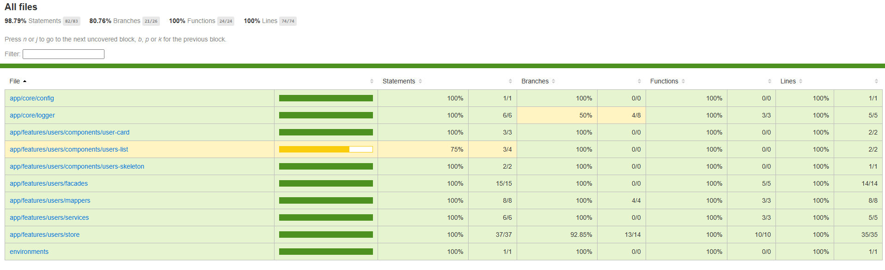

# LATAM User Management


Aplicación Angular moderna para gestión y visualización de usuarios, construida con arquitectura escalable, separación de responsabilidades y quality gates automatizados.

---

# Stack

- Angular 21
- TypeScript
- Standalone Components
- Angular Signals
- Tailwind CSS
- Angular Material
- Vitest
- ESLint
- Prettier
- Husky
- lint-staged
- GitHub Actions

---

# Arquitectura

El proyecto utiliza arquitectura **feature-first**:

```txt
src/app
├── core
│   ├── config
│   ├── interceptors
│   └── logger
├── features
│   └── users
│       ├── components
│       ├── facades
│       ├── mappers
│       ├── models
│       ├── pages
│       ├── services
│       └── store
├── layouts
└── shared
```

---

# Patrones utilizados

- Facade Pattern
- Store Pattern
- DTO Pattern
- Mapper Pattern
- HTTP Interceptors
- Centralized Logger
- Lazy Loading
- OnPush Change Detection
- Reactive State with Signals

---

# Funcionalidades

- Listado de usuarios
- Búsqueda reactiva con debounce
- Filtro por rol
- Filtro por estado
- Skeleton loading
- Empty state
- Manejo centralizado de errores HTTP
- UI responsive

---

# Scripts

```bash
npm start
npm run build
npm run lint
npm run format
npm run format:check
npm run test:run
npm run test:coverage
npm run validate
```

---

# Quality Gates

El proyecto valida automáticamente:

- Formato con Prettier
- Reglas de ESLint
- Tests unitarios con Vitest
- Coverage mínimo
- Build productivo

---

# Testing

La estrategia de testing prioriza lógica de negocio, estado, mappers, servicios y contratos de componentes.

```txt
Mapper tests
Store tests
Facade tests
Service tests
Logger tests
Config tests
Component smoke tests
```

---

# CI/CD

GitHub Actions ejecuta en cada push o pull request:

```txt
npm ci
npm run format:check
npm run lint
npm run test:coverage
npm run build
```

---

# Ejecutar proyecto

```bash
npm install
npm start
```

La aplicación quedará disponible en:

```txt
http://localhost:4200
```

---

# Coverage

El proyecto utiliza **Vitest + V8 Coverage** para medir cobertura de pruebas unitarias.

## Coverage visual

Métricas actuales del proyecto:

| Métrica    | Coverage |
| ---------- | -------: |
| Statements |   98.79% |
| Branches   |   80.76% |
| Functions  |     100% |
| Lines      |     100% |

Thresholds mínimos configurados:

```txt
Statements: 90%
Branches: 80%
Functions: 90%
Lines: 90%
```

Generar reporte:

```bash
npm run test:coverage
```

Abrir reporte HTML:

```txt
coverage/index.html
```

## Screenshot del reporte

El reporte HTML generado por Vitest se puede visualizar desde:

```txt
coverage/index.html
```

Screenshot referencial del reporte:



---

# Convenciones

## Commits

Se recomienda Conventional Commits:

```txt
feat:
fix:
refactor:
test:
docs:
chore:
```

Ejemplo:

```txt
feat(users): add users filtering
```

---

# Validaciones automáticas

Husky ejecuta antes de cada commit:

```txt
format check
eslint
tests
build validation
```

---

# Decisiones técnicas

Se priorizó una arquitectura moderna, escalable y altamente testeable utilizando capacidades recientes de Angular 21.

La aplicación utiliza Angular Signals para manejo reactivo de estado, combinados con patrones Store y Facade para separar lógica de negocio, estado y presentación.

La inyección de dependencias utiliza tanto `inject()` como constructor injection según el contexto, priorizando compatibilidad con Angular moderno, tree-shaking y facilidad de testing desacoplado.

Los stores, facades y servicios fueron diseñados para permitir unit testing aislado utilizando Vitest sin depender del runtime completo de Angular.

Los interceptors centralizan configuración HTTP, permitiendo extender fácilmente autenticación, headers, logging y manejo de errores globales.

La arquitectura feature-first permite escalar el proyecto agregando nuevos dominios funcionales sin afectar módulos existentes, favoreciendo mantenibilidad y separación de responsabilidades.

El proyecto incorpora quality gates automatizados mediante ESLint, Prettier, Husky, lint-staged, Vitest y coverage thresholds para garantizar consistencia y calidad de código.

---

# Roadmap

Posibles mejoras futuras:

- E2E testing con Playwright
- Storybook
- Dark mode
- Internacionalización (i18n)
- Pagination server-side
- Docker support
- Authentication module
- Role permissions
- CI deployment pipeline

---

# Autor

Carlos Javier López Aguayo

Senior Full Stack Developer
